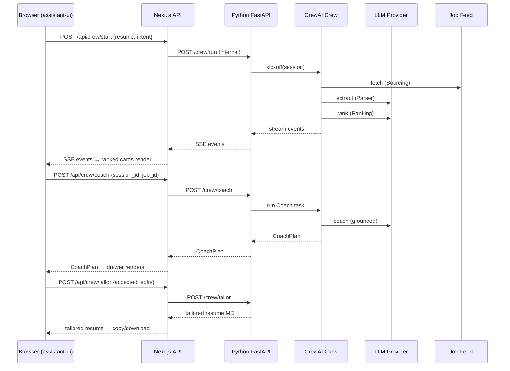

# System Architecture Document (SAD)
## Recruitment Assistant — Candidate-Side, Tech Roles

| Field | Value |
|---|---|
| **System** | Recruitment Assistant — multi-agent candidate-side tool |
| **Adapter** | `crewai` (default; `AAMAD_ADAPTER` was unset at generation time) |
| **Upstream artifacts** | `project-context/1.define/market-research.md`, `project-context/1.define/product-requirements-document.md` |
| **Author** | @system-arch |
| **Scope** | Full SAD covering all 10 template sections. MVP vs. Future Work is marked per section. |
| **Status** | Draft — pending handoff to @project-mgr for Phase 2 scaffold. |

### Traceability note
User stories were not provided as discrete files under `project-context/1.define/user-stories/`. This SAD traces to PRD feature IDs (**F-1**–**F-7**) as story proxies per PRD §4. See §Audit → Assumptions.

---

## 1. MVP Architecture Philosophy & Principles

### Design Principles
- **Explainability is a load-bearing architectural concern**, not a UX embellishment. The Ranking agent's `criteria[]` structured output *is* the product surface — the view layer renders it directly, with no reconstruction logic. *(PRD §1, §6; MRD §2.5.)*
- **Structured agent I/O over free-form chains.** Every agent emits schema-validated JSON; downstream agents consume the schema, not prose. This is the single largest lever for reliability and auditability. *(PRD §3, §11.)*
- **Session-scoped memory only for MVP.** Resumes contain PII; not persisting them is both a privacy stance and a complexity reduction. *(PRD §5.)*
- **Grounded coaching by design.** The Coach agent cannot emit resume edits without an `evidence_span`; skill gaps are a separate channel. This invariant is enforced by schema, not by hoping the LLM behaves. *(PRD §4 F-5, §11.)*
- **Bootcamp-realistic deployment.** Single container, single provider, single permitted source + seeded corpus. Not designed for horizontal scale or multi-tenant operation. *(MRD §2.4; PRD §5.)*

### Core vs. Future Feature Decision Framework
| Layer | MVP (Phase 3 Beta) | Future (Phase 3 Full) |
|---|---|---|
| Agents | Sourcing, Parser, Ranker, Coach | Interview-prep, learning-plan, outreach |
| Data sources | 1 permitted live feed + seeded corpus | Partner APIs, broader aggregation |
| Storage | In-memory / session | Postgres with accounts, history |
| Auth | None | NextAuth or equivalent |
| Deploy | Single container, one region | AWS App Runner + managed DB, multi-env |
| Tracing | Structured logs as audit trail | APM + distributed tracing |

### Technical Architecture Decisions (justifications)
- **Next.js App Router over Pages Router.** Server Components simplify streaming LLM responses from API routes; nested layouts fit the chat-shell + explainability-drawer UX without prop drilling. *(SAD template §1.)*
- **assistant-ui over custom chat.** Production-grade streaming, message rendering, and tool-output slots are available out of the box. Custom work is confined to the explainability drawer and ranked-role card. *(SAD template §3.)*
- **CrewAI sequential crew, not hierarchical.** The workflow has no branching that requires a manager agent. Sequential process keeps the dependency graph legible: Sourcing → Parser → Ranker → Coach. *(PRD §3.)*
- **Python CrewAI service behind Next.js API routes.** Keeps agent orchestration in Python (native CrewAI) while the web surface stays in the Node/TS ecosystem. API routes are the single integration seam. *(SAD template §4.)*
- **Streaming required for chat + progress visibility.** The crew runs for up to 90 s on a 15-role shortlist *(PRD §5)*; without streaming the UI would appear hung. API routes will stream crew progress events.

---

## 2. Multi-Agent System Specification

### Agent Architecture

Four specialized agents, sequential process, no delegation beyond the chain.

```mermaid
flowchart LR
  U[Candidate input: resume + intent] --> S[Sourcing Agent]
  S -->|JobList| P[Parser Agent]
  P -->|ParsedJob[], ParsedResume| R[Ranking Agent]
  R -->|RankedJob[]| UI1[UI: ranked cards + explainability]
  UI1 -->|Candidate selects a role| C[Coach Agent]
  C -->|CoachPlan| UI2[UI: Coach drawer]
  UI2 -->|Accepted edits| T[Tailoring task]
  T -->|TailoredResume| UI3[UI: copy / download]
```

#### Sourcing Agent *(PRD §3)*
- **Role**: tech-role sourcer.
- **Goal**: return 10–25 normalized live roles given a resume summary + intent.
- **Tools**: `job_feed_fetcher` (allowlist-enforced), `demo_corpus_reader`.
- **Memory**: session (no long-term).
- **Output schema**: `JobList`.
- **Runtime budget**: ≤ 20 s; on timeout, fall back to demo corpus with a degraded flag.

#### Parser Agent *(PRD §3, F-3)*
- **Role**: structured requirement extractor.
- **Goal**: convert each JD and the resume into strict structured records.
- **Tools**: `llm_structured_extract` (schema-constrained generation).
- **Memory**: session.
- **Output schemas**: `ParsedJob`, `ParsedResume`.
- **Runtime budget**: ≤ 30 s for 15 JDs + 1 resume (batch where the adapter allows).
- **Degradation**: on extraction failure for a single JD, retain the JD with `parse_status: degraded` and skip downstream ranking for that JD rather than fail the crew.

#### Ranking Agent *(PRD §3, F-4)*
- **Role**: multi-criteria fit ranker.
- **Goal**: per-criterion breakdown + overall score per JD.
- **Tools**: `llm_structured_rank`.
- **Memory**: session.
- **Output schema**: `RankedJob` with `criteria[]` carrying status, `required_in_jd`, `evidence_in_resume`, notes.
- **Runtime budget**: ≤ 30 s for 15 JDs.
- **Determinism requirement**: tie-breaking on overall score uses a deterministic secondary key (`job.id` lexicographic). *(PRD §4 F-4.)*

#### Coach Agent *(PRD §3, F-5)*
- **Role**: evidence-grounded resume coach.
- **Goal**: produce resume edits and labeled skill gaps for one selected role.
- **Tools**: `llm_structured_coach`.
- **Memory**: session (needs access to `ParsedResume`, the selected `RankedJob`, and the raw resume for span resolution).
- **Output schema**: `CoachPlan` with `edits[]` (each requiring a non-null `evidence_span`) and `gaps[]` (separate, never auto-merged).
- **Runtime budget**: ≤ 20 s per selected role.
- **Invariant (schema-enforced)**: `edits[].evidence_span` is `required: true`; `gaps[]` items cannot appear inside `edits[]`.

### Task Orchestration

| Step | Input | Output | Failure mode |
|---|---|---|---|
| T1 Source | `{resume_text, intent_prompt}` | `JobList` | Fallback to demo corpus |
| T2 Parse | `JobList`, `resume_text` | `ParsedJob[]`, `ParsedResume` | Per-JD degraded flag |
| T3 Rank | `ParsedJob[]`, `ParsedResume` | `RankedJob[]` | Per-JD drop with reason in logs |
| T4 Coach *(on-demand)* | `RankedJob`, `ParsedResume`, `resume_text` | `CoachPlan` | Retry once; then surface error in drawer |
| T5 Tailor *(on accept)* | `CoachPlan.accepted_edits[]`, `resume_text` | `TailoredResume` (Markdown) | Error toast; original resume preserved |

**Context passing**: shared session state object (see §4 Data Models). Agents read from and write to named keys rather than passing raw strings through prompts.

**Error handling**: a single top-level try/except per task boundary emits a typed error record into session state; the frontend subscribes to the task-event stream and renders actionable error UI. No silent drops.

**Performance ceilings** *(PRD §5)*:
- E2E shortlist render: ≤ 90 s for 15 roles.
- Coach plan: ≤ 20 s.
- Tailoring: ≤ 15 s.

### CrewAI Framework Configuration
- **Process type**: `Process.sequential`.
- **Memory**: short-term (session) only; long-term disabled for MVP.
- **Caching**: JD parses cached by content hash within a session — one parse, many ranks. *(PRD §8 Risk: LLM cost.)*
- **Verbose logging**: enabled in dev; structured (JSON) in prod. Per-agent prompt/response/latency captured — these logs are the audit trail. *(PRD §5 Compliance note.)*
- **Integration seam**: a single Python entrypoint (`run_crew(session_state) -> event_stream`) called from Next.js API routes.

---

## 3. Frontend Architecture Specification

### Technology Stack *(per SAD template §3)*
- **Framework**: Next.js 14+, App Router.
- **LLM UI**: assistant-ui.
- **Component library**: shadcn/ui.
- **Styling**: Tailwind CSS.
- **Types**: TypeScript end-to-end.
- **Client state**: Zustand (session state, accept/reject toggles for Coach edits).

### App Router Structure
```
apps/web/
  app/
    layout.tsx                 # global shell, theming
    page.tsx                   # landing → chat shell
    (chat)/
      layout.tsx               # chat + side panel layout
      page.tsx                 # assistant-ui composer + thread
    api/
      crew/
        start/route.ts         # POST: begin a session (F-1, F-2, F-3, F-4)
        stream/route.ts        # GET SSE: crew events
        coach/route.ts         # POST: run Coach on a selected role (F-5)
        tailor/route.ts        # POST: produce tailored resume (F-6)
  components/
    chat/
      composer.tsx             # assistant-ui composer wrapper
      thread.tsx               # assistant-ui thread wrapper
    roles/
      role-card.tsx            # ranked role summary card
      explainability-drawer.tsx# criteria breakdown + Coach drawer
      criteria-row.tsx         # matched / partial / missing row
      coach-plan.tsx           # edits[] + gaps[] with accept/reject
    common/
      privacy-note.tsx         # resume PII disclosure
  lib/
    api-client.ts              # typed client over API routes
    schemas.ts                 # zod schemas mirroring backend Pydantic
  store/
    session-store.ts           # zustand: current session, accepted edits
```

### assistant-ui Integration
- **Composer**: default assistant-ui composer, customized with:
  - Resume paste/upload affordance (textarea + file input, `.txt`/`.md` up to 200 KB). *(PRD F-1.)*
  - Intent prompt field (free text ≤ 500 chars).
  - Visible privacy note above composer: "Your resume is sent to our LLM provider to generate rankings. It is not stored beyond this session." *(PRD §5.)*
- **Thread**: default assistant-ui thread. Assistant messages surface:
  - Progress ticks as the crew runs (streamed via SSE).
  - A tool-output block rendering the ranked-role list (→ `role-card` components).
  - Explainability drawer opens on card click; Coach plan loaded on demand.
- **Streaming**: SSE from `/api/crew/stream`. Event types: `sourcing.done`, `parsing.done`, `ranking.done`, `ranking.update`, `error`, `coach.done`, `tailor.done`.
- **Custom tool components**: `role-card`, `explainability-drawer`, `coach-plan`, `criteria-row`. These are assistant-ui tool-output renderers, not separate chat roles.

### User Interface
- **Primary surface**: single chat page with a right-side drawer for explainability + Coach plan. On mobile, drawer becomes a full-screen modal.
- **Transparency default** *(PRD §6)*: the `criteria[]` breakdown is visible on the ranked-role card at a glance (top 3 criteria) and fully expanded in the drawer.
- **Loading states**: per-stage progress chips — Sourcing → Parsing → Ranking → (Coach on demand).
- **Error states**: inline chat-log messages with retry affordance; never a silent failure.
- **Accessibility**: semantic HTML, keyboard navigation for the drawer and accept/reject, ARIA live region for streaming progress. WCAG AA as a directional target. *(PRD §6.)*

---

## 4. Backend Architecture Specification

### API Architecture

| Route | Method | Purpose | Request | Response |
|---|---|---|---|---|
| `/api/crew/start` | POST | Begin a session, kick off T1–T3 | `{resume_text, intent_prompt}` | `{session_id}` |
| `/api/crew/stream` | GET (SSE) | Stream crew events | `?session_id=` | `event: <type>\ndata: <payload>` |
| `/api/crew/coach` | POST | Run T4 on a selected role | `{session_id, job_id}` | `CoachPlan` |
| `/api/crew/tailor` | POST | Run T5 with accepted edits | `{session_id, job_id, accepted_edit_ids[]}` | `{tailored_resume_md}` |
| `/api/health` | GET | Liveness | — | `{status: "ok"}` |

- **Validation**: zod on the Next.js edge of each route, mirroring Pydantic schemas on the Python service. Fail fast on size/shape.
- **Rate limiting**: in-memory token bucket per IP, 5 sessions/hour. Bootcamp scale; not a production policy.
- **Security middleware**: standard Next.js helmet-style headers; CORS restricted to the deployed origin.
- **Error handling**: typed error envelope `{error: {code, message, retriable}}`.

### Integration Layer (Next.js ↔ CrewAI)

**Transport**: HTTP between the Next.js server and a sidecar Python FastAPI service that wraps the CrewAI crew.

```
[Browser]
   │ SSE / JSON
[Next.js API routes]
   │ HTTP/JSON (internal)
[Python FastAPI: /crew/run, /crew/coach, /crew/tailor]
   │ function calls
[CrewAI crew: Sourcing, Parser, Ranker, Coach]
   │ LLM/HTTP
[LLM provider] [Job feed(s)] [Demo corpus]
```

- **Why sidecar, not in-process**: CrewAI is Python-native; bridging over a localhost HTTP boundary is simpler than embedding a Python runtime in Node.
- **Session state**: kept server-side in the Python service, keyed by `session_id`, with a TTL of 1 hour. No persistence to disk. *(PRD §5.)*
- **Event stream**: the Python service writes events to an in-memory pub/sub channel per session; the Next.js SSE route subscribes and forwards.

### Data Models (session-scoped)

All schemas are defined as Pydantic models on the backend and mirrored as zod schemas on the frontend.

```yaml
# Sourcing
JobList:
  jobs: Job[]
Job:
  id: string             # hash(source + url)
  title: string
  company: string
  location: string | null
  url: string
  source: enum           # e.g., "hn_whos_hiring", "demo_corpus"
  raw_description: string

# Parsing
ParsedJob:
  job_id: string
  skills: string[]
  must_have: Requirement[]
  nice_to_have: Requirement[]
  seniority: enum        # intern | junior | mid | senior | staff | principal | unknown
  years_experience_min: int | null
  parse_status: enum     # ok | degraded
Requirement:
  text: string           # verbatim span from JD
  tags: string[]         # normalized skill tags

ParsedResume:
  skills: string[]
  experience_items: ExperienceItem[]
  education: EducationItem[]
  years_experience_total: int | null
ExperienceItem:
  title: string
  company: string
  start: string          # ISO year-month
  end: string | null
  bullets: Span[]
Span:
  text: string           # verbatim resume text
  start_char: int
  end_char: int

# Ranking
RankedJob:
  job_id: string
  overall_score: float   # 0.0 – 1.0
  criteria: Criterion[]
  reasoning_summary: string
Criterion:
  name: string           # e.g., "3+ yrs Python"
  status: enum           # matched | partial | missing
  required_in_jd: string # span from JD
  evidence_in_resume: Span | null
  notes: string

# Coaching
CoachPlan:
  job_id: string
  edits: CoachEdit[]
  gaps: CoachGap[]
CoachEdit:
  id: string
  target_section: enum   # experience | skills | summary | projects | education
  target_span: Span      # existing resume content being edited
  suggested_text: string
  evidence_span: Span    # REQUIRED; non-null
  rationale: string
CoachGap:
  skill: string
  why_it_matters: string
  learn_path_hint: string | null
```

**Invariants enforced by schema**:
- `CoachEdit.evidence_span` is non-nullable; an edit lacking evidence fails validation and is dropped with a logged warning.
- `CoachGap` items cannot appear in `edits[]` and vice versa. The Coach prompt is instructed to separate them; the schema is the backstop.
- `RankedJob.criteria` must be non-empty for jobs with `parse_status: ok`.

### Database / Storage Specification
- **MVP**: no database. Session state lives in a Python-process-memory dict keyed by `session_id`, TTL 1 hour. *(PRD §5.)*
- **Future migration path**: SQLite for local dev / single-node; Postgres + Prisma for multi-user. Schemas above would round-trip to normalized tables (`sessions`, `jobs`, `parsed_jobs`, `ranked_jobs`, `coach_plans`, `tailored_resumes`).
- **Retention**: in-memory TTL 1 hour; no explicit cleanup required beyond TTL expiry. Future phase introduces a retention policy (e.g., 30-day resume purge with user delete).
- **Backup**: N/A for MVP (ephemeral data).

### Authentication & Security

- **Auth (MVP)**: none. Single-session, no accounts. *(PRD §5.)*
- **Auth (Future)**: NextAuth with email magic links or OAuth, introduced with persistence.
- **Secrets**: LLM API keys and any job-feed credentials via environment variables; never in the repo. `.env.example` documents the required vars.
- **Input validation**: zod (frontend edge) + Pydantic (backend). Hard limits on resume size (200 KB) and intent prompt length (500 chars). *(PRD F-1.)*
- **Rate limiting**: in-memory token bucket per IP (5 sessions/hr, 20 Coach calls/hr).
- **CORS**: restrict to deployment origin.
- **Security headers**: CSP (no inline except assistant-ui essentials), `X-Content-Type-Options: nosniff`, `Referrer-Policy: strict-origin-when-cross-origin`.
- **PII handling**: resumes never logged in full; audit logs store a content hash and the per-agent structured outputs, not raw resume text.
- **Data source allowlist**: a code-level constant enumerates permitted sources. Sourcing agent tool refuses any URL not matching. *(MRD §4; PRD §11.)*

---

## 5. DevOps & Deployment Architecture

### MVP Deployment *(bootcamp-appropriate)*
- Single Docker Compose stack: `web` (Next.js) + `crew` (Python FastAPI) + optional `reverse-proxy`.
- Local development: `pnpm dev` and `uv run fastapi dev` via a `make dev` convenience.
- Single-VM cloud deployment is sufficient for demos. *(MRD §2.4; PRD §5.)*

### CI/CD (minimal but real)
- **GitHub Actions workflow**:
  - `lint`: eslint (TS) + ruff (Py).
  - `typecheck`: `tsc --noEmit` + `mypy` (backend).
  - `test`: jest (frontend unit) + pytest (backend unit + parsing eval) + playwright (smoke E2E against local stack).
  - `build`: docker build for both images.
  - `deploy` *(manual approval gate)*: SSH deploy to the demo VM or push to a registry.
- **Deployment gates**: lint + typecheck + unit tests + playwright smoke must pass. No auto-deploy to anything user-facing; bootcamp demos are pulled manually.

### AWS App Runner *(template default — deferred for bootcamp)*
Per SAD template §5, App Runner is the prescribed target. For the bootcamp, App Runner is overkill and adds IaC/secrets-manager complexity that distracts from the core learning goals. Capturing the path for future-phase adoption:
- Compute: 0.5 vCPU / 1 GB baseline per service; auto-scale trigger at 70% CPU.
- Health check: `/api/health`.
- Secrets: AWS Secrets Manager; env bound at service start.
- Networking: VPC connector for private LLM provider endpoints if needed; else public egress.

### Infrastructure as Code *(deferred for bootcamp)*
- Future phase: Terraform module per environment (dev/staging/prod), state in S3 + DynamoDB locking.

### Monitoring & Observability
- **MVP**: structured JSON logs to stdout (aggregated via docker logs). Fields: `session_id`, `agent`, `task`, `latency_ms`, `tokens_in`, `tokens_out`, `status`.
- **Alerting**: none for MVP; reviewers inspect logs post-demo.
- **Future phase**: OpenTelemetry traces across Next.js ↔ Python, Grafana/Loki dashboards, PagerDuty for on-call.

---

## 6. Data Flow & Integration Architecture

### Happy-path Sequence *(PRD F-1 → F-7)*



### Degradation Paths
- **Sourcing failure** → fallback to demo corpus with a visible "Using demo results" notice. *(PRD F-2.)*
- **Per-JD parse failure** → retain JD with `parse_status: degraded`, exclude from ranking, surface in UI as "couldn't analyze." *(PRD F-3.)*
- **Ranker failure for a JD** → drop from shortlist with rationale in logs; do not fail the whole session.
- **Coach failure** → retry once; then show retry affordance; original resume and ranked list remain intact. *(PRD F-5.)*
- **LLM provider outage** → surface a specific error; offer retry; session state retained in memory for the TTL.

### External Integrations
- **LLM provider** (one, behind a thin abstraction): chat completions + schema-constrained generation.
- **Job feeds (MVP)**: one permitted public feed (e.g., Hacker News "Who is hiring" monthly thread via its public API, or a similar ToS-compatible source) + a seeded corpus of 10–25 JDs committed to the repo for reproducible demos.
- **No ATS write-back.** Candidates apply via the role's native URL. *(PRD §4, scope boundary.)*

### Caching Strategy
- **Within a session**: parsed JDs cached by content hash. One parse, many ranks.
- **Across sessions**: none in MVP. Future phase: shared parse cache for common JDs across users, gated behind explicit opt-in due to PII considerations.

### Analytics & Feedback *(minimal for MVP)*
- Event capture: session start, shortlist rendered, role opened, edit accepted/rejected, tailored resume exported. Logged as structured events, anonymized (no resume contents).
- Post-demo feedback: collected offline via the bootcamp review process, not an in-app survey.

---

## 7. Performance & Scalability Specifications

### Performance Targets *(carried from PRD §5)*
| Operation | Target | Strategy |
|---|---|---|
| E2E shortlist (resume → 15 ranked cards) | ≤ 90 s | Parallelize Parser+Ranker per-JD where adapter allows; stream progress |
| Coach plan per role | ≤ 20 s | Single LLM call with full JD + resume context |
| Tailor on accept | ≤ 15 s | Deterministic application of accepted edits; minimal LLM rewrite scope |
| Frontend TTI | ≤ 3 s | Next.js App Router + Server Components for shell; defer non-critical JS |
| JD parse schema validity | ≥ 95% | Schema-constrained generation + eval harness |
| Crew run success rate | ≥ 90% | Typed error boundaries at each task; degraded-mode fallbacks |

### Scalability
- **MVP**: 1–5 concurrent sessions target. Single Python FastAPI process, single Next.js process. No horizontal scaling. *(MRD §2.4; PRD §5.)*
- **Future triggers**: > 20 concurrent sessions or > 70% CPU sustained → scale the Python service horizontally behind a load balancer; session state moves to Redis for cross-instance visibility.
- **Database scaling**: N/A for MVP. Future path: SQLite → Postgres with read replicas for heavy query workloads.

### Resource Optimization
- **Token budget per session**: soft cap of ~60k input + ~15k output across the whole crew for a 15-role shortlist. Parser and Ranker dominate.
- **Memory**: ≤ 200 MB per active session (Python process) for a 15-role shortlist.
- **Bandwidth**: SSE keeps event payloads < 4 KB each.
- **LLM cost**: JD parse cache is the single highest-leverage optimization; without it, re-ranking under different intents would re-parse JDs unnecessarily.

---

## 8. Security & Compliance Architecture

### Security Framework
- **AuthN/Z**: none in MVP.
- **Encryption in transit**: HTTPS for browser ↔ Next.js; HTTP on localhost for Next.js ↔ Python (both containers on same host). Future phase: mTLS if services separate.
- **Encryption at rest**: N/A for MVP (no persistent storage). Future phase: Postgres TDE or equivalent.
- **Input validation**: enforced at both edges (zod + Pydantic).
- **Secrets**: env vars, `.env.example` documents required keys, `.env` is gitignored.
- **Vulnerability management**: `npm audit` + `pip-audit` in CI; block on high-severity.
- **Dependency pinning**: lockfiles required (`pnpm-lock.yaml`, `uv.lock`) — the repo already has `uv.lock` per git status.

### Data Privacy & Compliance
- **PII**: resumes. Not persisted; not logged; sent to LLM provider only as required for agent tasks. Privacy disclosure shown on the composer. *(PRD §5.)*
- **GDPR / CCPA**: not in scope for bootcamp MVP (no accounts, no persistent storage, no cross-border processing claims). Documented distinction carried forward.
- **Hiring regulations (EEOC, NYC AEDT, EU AI Act)**: these regulate *employer* decision systems. This is a *candidate-side* tool — ranking targets the candidate's own job search, not hiring outcomes. Documented in PRD §5 and carried here for traceability. *(MRD §2.4; PRD §5.)*
- **Audit logging**: per-agent structured logs constitute the audit trail for explainability claims. No raw resume content in logs; content hashes only.

---

## 9. Testing & Quality Assurance Specifications

### Testing Strategy
| Layer | Framework | Coverage goal | Notes |
|---|---|---|---|
| Frontend unit | jest + @testing-library/react | ≥ 70% lines on `components/` | Happy-path renders + accept/reject toggles |
| Backend unit | pytest | ≥ 70% lines on agents and tools | Schema validation, tool allowlist enforcement |
| Integration | pytest + FastAPI TestClient | Each API route hit | Mock LLM provider with recorded fixtures |
| E2E smoke | Playwright | 3 scenarios from PRD §9 | Happy path, career switcher, sourcing degradation |
| Evals | pytest + custom harness | See below | Quality gates, not pass/fail by line coverage |

### Evals *(the key QA surface for this product)*
- **JD parsing eval** *(PRD §8)*:
  - ≥ 20 hand-labeled JDs across seniority + specializations.
  - Metric: schema validity ≥ 95%; field-level F1 on `must_have` ≥ 0.75.
- **Coach grounding eval** *(PRD §8, F-5)*:
  - ≥ 10 resume/JD pairs.
  - Metric: **zero** unlabeled invented-experience incidents. This is the single hardest gate — regressions block merge.
- **Ranker criterion coverage**:
  - ≥ 90% of a JD's `must_have` items appear as explicit `criteria[]` entries.

### Quality Gates
- CI blocks merge on: failing lints, failing typechecks, failing unit tests, failing JD parsing eval, failing Coach grounding eval, failing Playwright smoke.
- Coverage reports posted to the PR, but thresholds are directional (not hard gates) — eval quality is the real gate.

---

## 10. MVP Launch & Feedback Strategy

### Demo Plan *(bootcamp review, replaces beta)* — carried from PRD §9
- **Scenario 1 — Happy path**: mid-level backend engineer resume + "remote Python platform roles" → 15 ranked roles, explainability drawer, tailored resume for the top match.
- **Scenario 2 — Career switcher**: bootcamp-grad resume + "junior software engineering" → demonstrates Coach `gaps[]` output with explicit skill-gap labeling and no inventions.
- **Scenario 3 — Degradation**: forced sourcing failure → demo corpus fallback with visible "Using demo results" notice; crew completes without user-visible error.

### UX Optimization
- **Onboarding**: single screen — composer + privacy note. No tutorial required; the chat UX is the tutorial.
- **In-app help**: tooltip on each criterion status (matched / partial / missing) explaining what it means.
- **Feedback**: bootcamp-offline, not in-app.

### Business Metrics
- Not applicable for bootcamp MVP. *(PRD §7.)* Future phase: activation rate, D7/D30 retention, paid-conversion if a freemium model is introduced.

---

## 11. Traceability Matrix

| PRD ID | PRD Feature | Primary SAD section(s) | Primary components |
|---|---|---|---|
| F-1 | Resume + intent intake | §3 (composer), §4 (api/crew/start) | `components/chat/composer.tsx`, `app/api/crew/start/route.ts` |
| F-2 | Role discovery | §2 (Sourcing), §4, §6 | Sourcing agent, demo corpus reader, allowlist |
| F-3 | Structured parsing | §2 (Parser), §4 (schemas) | Parser agent, `ParsedJob`, `ParsedResume` |
| F-4 | Multi-criterion ranking + explainability | §2 (Ranker), §3 (drawer) | Ranker agent, `RankedJob`, `explainability-drawer` |
| F-5 | Evidence-grounded coaching | §2 (Coach), §4 (CoachPlan invariants) | Coach agent, `CoachPlan` schema validator |
| F-6 | Resume tailoring on accept | §2 (T5), §3 (CoachPlan UI), §4 (api/crew/tailor) | Tailoring task, `coach-plan.tsx`, tailor route |
| F-7 | Chat shell + drawer | §3 | assistant-ui + custom tool components |

Each PRD feature maps to at least one component in the logical view and at least one task in the process view. No PRD P0 feature is orphaned.

---

## 12. Risks & Architectural Decisions

### Architectural Decisions (carried or new)
| # | Decision | Alternative considered | Rationale |
|---|---|---|---|
| AD-1 | CrewAI `Process.sequential`, 4 agents | Hierarchical (manager agent) | Workflow has no branching; sequential is more legible and cheaper |
| AD-2 | Python FastAPI sidecar behind Next.js API routes | In-process Node with LangChain.js | CrewAI is Python-native; bridging a sidecar is simpler than porting |
| AD-3 | Schema-constrained LLM output (Pydantic + zod) | Prose with post-hoc parsing | Invariants (e.g., Coach `evidence_span` required) are enforceable at the type system |
| AD-4 | Session-only in-memory state | SQLite or Postgres from day 1 | PRD §5: no persistence in MVP; reduces PII blast radius |
| AD-5 | One permitted source + seeded corpus | LinkedIn/Indeed scraping | ToS compliance is non-negotiable; demo reproducibility is an MVP benefit |
| AD-6 | SSE for crew events | WebSockets | SSE is simpler, one-way, plays cleanly with assistant-ui streaming |
| AD-7 | assistant-ui for chat surface | Custom chat | Template-prescribed; production-grade streaming out of the box |

### Risks (carried from MRD §4 / PRD §8)
| Risk | Severity | Mitigation (architectural) |
|---|---|---|
| Data access / ToS violation | High | Code-level allowlist in Sourcing tool; AD-5 |
| Hallucinated resume experience | High | `CoachEdit.evidence_span` non-nullable at schema; Coach grounding eval blocks merge; AD-3 |
| JD parse variance | Medium | Schema-constrained extraction; `parse_status: degraded` path; per-JD retry |
| LLM cost / latency | Medium | Per-session JD parse cache; parallel Parser+Ranker where adapter allows |
| Candidate trust in AI ranking | Medium | Explainability-by-default in UI; `criteria[]` is the rendered surface |
| LLM provider outage | Low | Typed error surface + retry affordance; session state retained for TTL |

---

## 13. Future Work / Deferrals

Explicitly deferred from MVP to keep bootcamp scope tractable:

- Authentication (NextAuth), persistent storage (SQLite → Postgres + Prisma), accounts and session history.
- AWS App Runner deployment, Terraform IaC, multi-environment pipelines.
- OpenTelemetry tracing, APM, alerting, on-call.
- Interview-prep and skill-gap-learning agents (PRD P2).
- Application-tracker export, PDF resume ingest (PRD P1).
- Expanded job sources via partner APIs.
- Cross-session caching and shared parse cache.
- GDPR / CCPA compliance controls at the account level.

Each deferral has a corresponding place in this SAD where it would slot in; nothing is architected out.

---

## 14. Audit

- **AAMAD adapter resolved**: `crewai` (default). `AAMAD_ADAPTER` environment variable was **unset** at generation time. *(Per system-arch persona instructions, the resolved adapter is recorded here.)*
- **Template used**: `.cursor/templates/sad-template.md`. Section headings preserved.
- **Inputs consulted**: `project-context/1.define/market-research.md`, `project-context/1.define/product-requirements-document.md`, `.cursor/agents/system-arch.md`, `.cursor/templates/sad-template.md`.
- **Outputs produced**: `project-context/1.define/sad.md` (this document).
- **Prohibited actions respected**: no new product requirements introduced beyond MRD/PRD; no non-MVP components added as MVP; no code or pipeline modifications made.

### Assumptions
1. The four-agent decomposition (Sourcing, Parser, Ranker, Coach) locked in PRD §3 is authoritative. The SAD does not revisit agent count or role split.
2. "User stories" in PRD §4 (F-1 … F-7) serve as the story proxies for traceability, since `project-context/1.define/user-stories/` is empty.
3. Template section headings (e.g., AWS App Runner) apply as-stated; where bootcamp scope doesn't require them, they are marked "deferred" with a clear future-phase placement rather than removed.
4. The "permitted live feed" for sourcing is resolvable (e.g., Hacker News "Who is hiring" public API or an equivalent ToS-safe source). Final source selection is a @project-mgr scaffold task.
5. The LLM provider supports schema-constrained generation (JSON mode or equivalent tool-use). If a chosen provider does not, the Parser/Ranker/Coach tools need a validation-and-retry loop, adding latency.

### Open Questions
1. **User-stories directory.** Should PRD features (F-1 … F-7) be split into discrete files under `project-context/1.define/user-stories/` to enable per-feature SFS generation via `@system-arch *create-sfs`? (Recommend: yes, before Phase 2 build starts.)
2. **Permitted source selection.** Which public feed is the primary live source for MVP? Candidates: Hacker News "Who is hiring" monthly thread, a specific job-board RSS, or a partner API. @project-mgr to confirm during scaffold.
3. **LLM provider choice.** Not specified in MRD/PRD. Recommend selecting one with robust schema-constrained generation (e.g., Anthropic or OpenAI) during scaffold; impacts Parser/Ranker/Coach reliability.
5. **Eval dataset ownership.** Who curates the 20-JD parsing eval set and 10-pair Coach grounding eval? @qa-eng by role, but the candidate resumes needed for grounding evals touch PII concerns — recommend synthetic or publicly shared resumes only.

### Next Deliverables
- `@system-arch *create-sfs` per P0 feature (recommend: F-4 Ranking + F-5 Coaching first — highest design density).
- `@project-mgr` scaffold: monorepo layout, lockfiles, env example, Docker Compose stack, CI workflow skeleton.

---

*Artifact path: `project-context/1.define/sad.md`*
*Upstream: `project-context/1.define/market-research.md`, `project-context/1.define/product-requirements-document.md`*
*Next artifact(s): SFS files under `project-context/1.define/sfs/` by @system-arch; scaffold by @project-mgr.*
